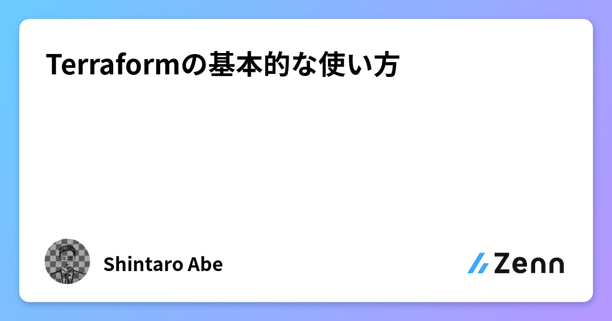
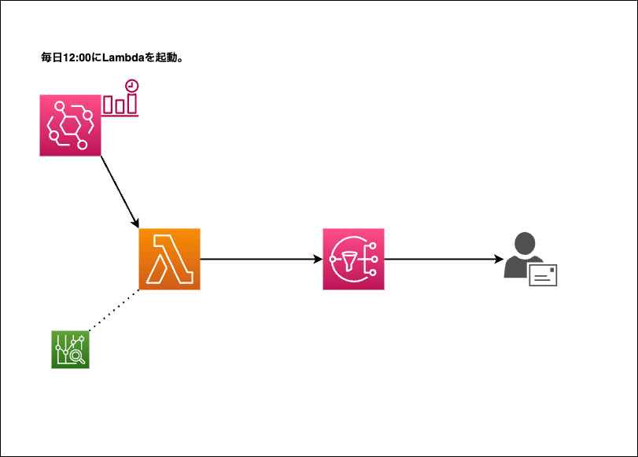

# terraform-practice
## Refferemce article
Zennに投稿した、「Terraformの基本的な使い方」に掲載したコードを収録したリポジトリ。

<a href="https://zenn.dev/lifewithpiano/articles/terraform_practice2304">

## Summary
毎日12時にEventbridgeでAWSの請求額を取得するLambda関数を起動させ、SNSから通知メールを送信するシステム。
学習のため、あえてStepFunctionsを使用して構築。

## Regarding source codes
#### providers.tf
クラウドプロバイダーやAPIの操作を可能にするための設定。

#### backend.tf
構築したインフラの状態を保存するデータの格納先を指定。

#### S3BucketPolicy.json
バージョニングを有効にしたバケットに追加する、バケットポリシー。
プリンシパルは、使用するアクセスキーIDのユーザーarn。

#### variables.tf
変数を定義。

#### data.tf
main.tfが参照する値を定義。

#### cost.py
[Developers IO 藤井元貴さん作成のapp.py](https://dev.classmethod.jp/articles/notify-slack-aws-billing/)を参考にさせていただきました。
